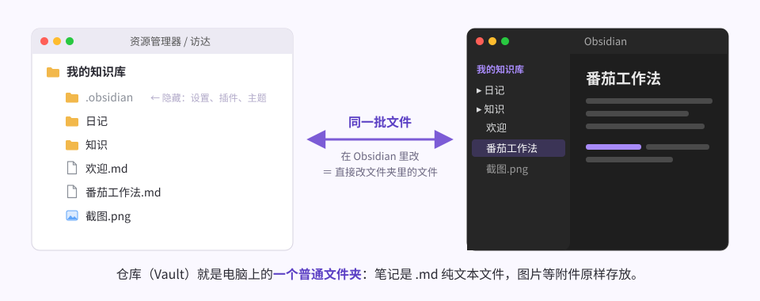
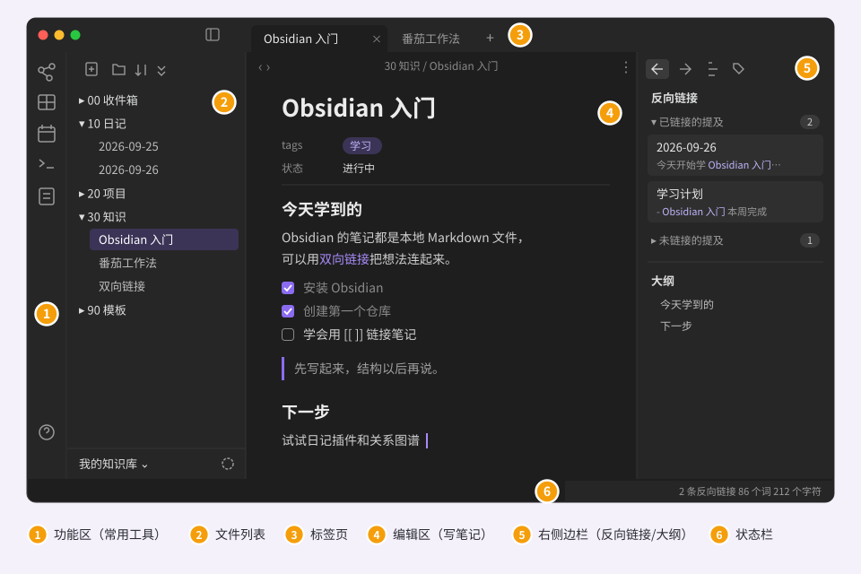
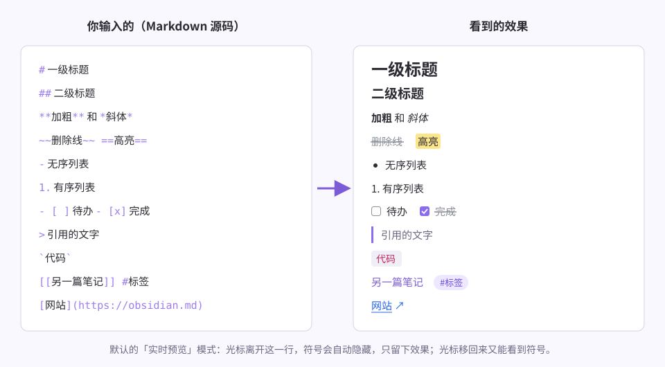
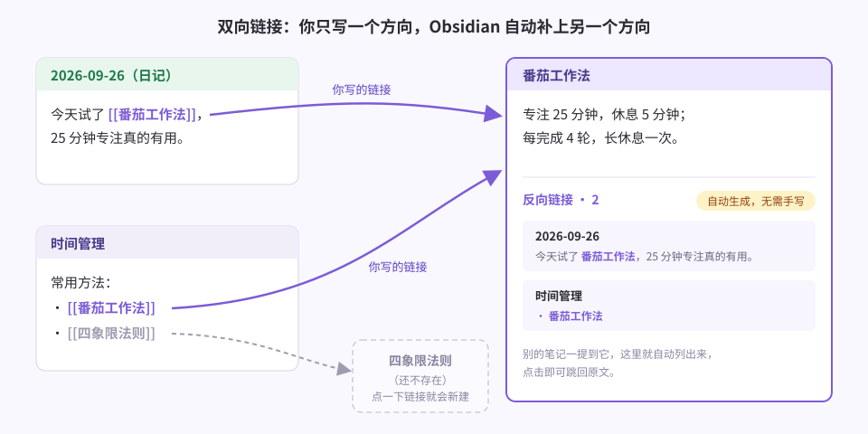
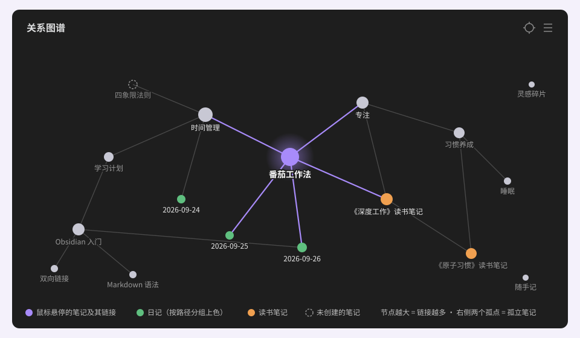
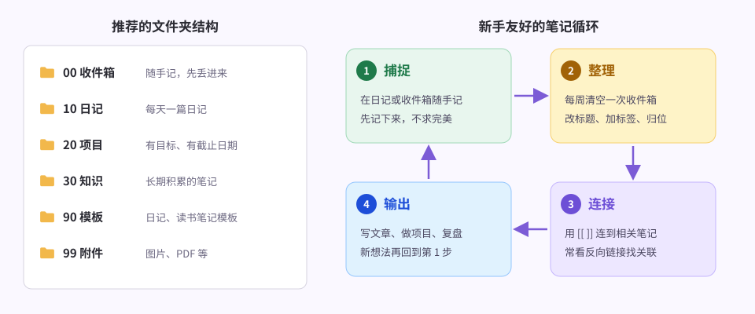

# Obsidian 新手上手指南：从安装到建立你的第一个知识库

> 写给**第一次接触 Obsidian** 的人，就算没听说过 Markdown 也没关系。
> 跟着做一遍大约 30～60 分钟，做完就能顺手地记笔记。
>
> 说明：文中配图是示意图，实际界面会随版本、主题略有不同；菜单名称以简体中文界面为准。

## 目录

1. [Obsidian 是什么](#1-obsidian-是什么)
2. [下载、安装、切换中文](#2-下载安装切换中文)
3. [创建第一个仓库（Vault）](#3-创建第一个仓库vault)
4. [认识界面](#4-认识界面)
5. [写下第一篇笔记 + Markdown 速成](#5-写下第一篇笔记--markdown-速成)
6. [核心技能：双向链接](#6-核心技能双向链接)
7. [标签与属性](#7-标签与属性)
8. [搜索、快速切换、命令面板](#8-搜索快速切换命令面板)
9. [关系图谱](#9-关系图谱)
10. [值得打开的核心插件（日记、模板、白板……）](#10-值得打开的核心插件)
11. [社区插件](#11-社区插件)
12. [外观与主题](#12-外观与主题)
13. [多设备同步与备份](#13-多设备同步与备份)
14. [推荐的文件夹结构与工作流](#14-推荐的文件夹结构与工作流)
15. [必记快捷键](#15-必记快捷键)
16. [常见问题](#16-常见问题)
17. [7 天上手计划](#17-7-天上手计划)

---

## 1. Obsidian 是什么

Obsidian 是一款**笔记 / 知识管理软件**，它有三个最大的特点：

| 特点 | 意思 | 对你的好处 |
| --- | --- | --- |
| **本地优先** | 笔记就是你电脑上的 `.md` 纯文本文件 | 离线可用；软件哪天不用了，文件照样能用任何编辑器打开 |
| **双向链接** | 用 `[[ ]]` 把笔记互相连起来 | 笔记不再是孤岛，慢慢长成一张知识网 |
| **插件生态** | 官方核心插件 + 数千个社区插件 | 日记、看板、画图、数据库……按需添加 |

**价格**：软件本身个人和工作使用都免费。官方的 **Sync（同步）** 和 **Publish（发布成网站）** 是可选的付费服务，不买也完全能用。

**适合谁**：想长期积累知识、写读书笔记/学习笔记/日记、希望数据掌握在自己手里的人。
**不太适合**：需要多人实时协作编辑同一份文档（这类场景用飞书、Notion、腾讯文档更顺手）。

---

## 2. 下载、安装、切换中文

1. 打开官网 **<https://obsidian.md>**，点 **Download**，选择你的系统：Windows / macOS / Linux。
2. 手机端：iPhone / iPad 在 App Store 搜索 “Obsidian”；安卓在 Google Play 或官网下载安装包。
3. **切换中文界面**：
   - 首次启动的欢迎界面下方就有语言选项，直接选「简体中文」；
   - 或者进入软件后：左下角 ⚙️ **设置 → 通用（General）→ 语言（Language）→ 简体中文**，按提示重启即可。

---

## 3. 创建第一个仓库（Vault）

先理解一个最重要的概念：**仓库（Vault）= 电脑上的一个普通文件夹**。Obsidian 只是用来读、写这个文件夹里的 `.md` 文件。



第一次打开 Obsidian，你会看到三个选项：

| 选项 | 什么时候用 |
| --- | --- |
| **新建仓库** | 从零开始 —— 新手选这个 ✅ |
| **打开本地仓库**（打开文件夹作为仓库） | 你已经有一个装满 `.md` 文件的文件夹 |
| **通过 Obsidian Sync 打开** | 已购买官方同步、在新设备上拉取 |

操作步骤：

1. 点 **新建仓库**；
2. **仓库名称**：比如 `我的知识库`；
3. **位置**：建议放在「文档」之类的固定目录。
   如果你打算用 iCloud 在苹果设备间同步，请放到 **iCloud 云盘 → Obsidian** 文件夹里（见 [第 13 节](#13-多设备同步与备份)）；
4. 点 **创建**。

> 💡 仓库里会自动出现一个隐藏的 `.obsidian` 文件夹，里面是这个仓库的设置、插件和主题。**不要删它**；想把整套配置复制到新仓库，复制这个文件夹即可。
>
> 💡 你可以有多个仓库（比如「工作」「生活」分开），左下角点仓库名就能切换。但新手建议**只用一个仓库**，靠文件夹和链接来区分内容。

---

## 4. 认识界面



| 编号 | 区域 | 作用 |
| --- | --- | --- |
| ① | **功能区**（Ribbon） | 最左边一竖排图标：打开关系图谱、新建白板、打开今日日记、命令面板等 |
| ② | **文件列表** | 仓库里的文件夹和笔记；上方按钮可新建笔记/文件夹、排序、折叠 |
| ③ | **标签页** | 像浏览器一样可以同时打开多篇笔记；拖动标签页可以左右/上下分屏 |
| ④ | **编辑区** | 写笔记的地方 |
| ⑤ | **右侧边栏** | 反向链接、出链、大纲、标签等面板（顶部小图标切换） |
| ⑥ | **状态栏** | 反向链接数、字数、字符数等 |

小技巧：
- 左上角、右上角的侧边栏按钮可以**收起/展开**两侧边栏，专心写作时很好用。
- 所有面板都可以用鼠标拖到别的位置，拖乱了也不要紧，可以随时拖回来。
- 在标签页上**右键**，可以选择「左右分屏」「上下分屏」，一边看资料一边写笔记。

---

## 5. 写下第一篇笔记 + Markdown 速成

### 5.1 新建笔记

- 按 **`Ctrl + N`**（Mac 为 `Cmd + N`），或点文件列表上方的「新建笔记」按钮；
- 笔记最上方的大标题就是**文件名**，直接改它即可；
- **不需要保存**，Obsidian 会自动实时保存。

### 5.2 三种视图

| 视图 | 说明 | 切换方法 |
| --- | --- | --- |
| **实时预览**（默认） | 边写边看效果，所见即所得，新手最友好 | — |
| **源码模式** | 显示全部 Markdown 符号 | 右上角 `⋮` 更多选项 → 切换 |
| **阅读视图** | 只读、排版最干净 | `Ctrl/Cmd + E` 在编辑与阅读之间切换 |

### 5.3 Markdown：只需记住这十来个符号

Markdown 就是「用几个简单符号表示格式」的写法。左边是你输入的，右边是显示效果：



| 想要的效果 | 输入 |
| --- | --- |
| 标题（1～6 级） | `# 一级标题`、`## 二级标题` …（`#` 后面要有空格） |
| 加粗 / 斜体 | `**加粗**`、`*斜体*`（或选中文字按 `Ctrl/Cmd + B` / `I`） |
| 删除线 / 高亮 | `~~删除线~~`、`==高亮==` |
| 无序 / 有序列表 | `- 内容`、`1. 内容`（按 `Tab` 缩进成子项） |
| 待办事项 | `- [ ] 待办`，点击方框即可打勾，或按 `Ctrl/Cmd + L` |
| 引用 | `> 引用的文字` |
| 代码 | 行内用 `` `代码` ``，多行用三个反引号 ```` ``` ```` 包起来 |
| 分割线 | 单独一行 `---` |
| 网页链接 | `[文字](https://网址)` |
| 表格 | 命令面板搜「插入表格」，不用手敲 |

> 💡 **插入图片**：直接把图片**拖进来**或 **`Ctrl/Cmd + V` 粘贴**截图就行。
> 为了不让图片散落各处，建议先去 **设置 → 文件与链接 → 新附件的默认位置**，选「指定的附件文件夹」，填 `99 附件`。

> 💡 **Callout（提示框）**：Obsidian 特有的漂亮提示框：
> ```markdown
> > [!tip] 小技巧
> > 这里是提示内容。
> ```
> 常用类型还有 `[!note]`、`[!warning]`、`[!question]`。

---

## 6. 核心技能：双向链接

这是 Obsidian 和普通笔记软件**最大的区别**，一定要掌握。



### 6.1 怎么建链接

1. 在笔记里输入 **`[[`**，会弹出一个笔记列表；
2. 继续输入几个字筛选，回车选中；
3. 完成！它就变成一个可以点击跳转的链接。

**链接到还不存在的笔记也完全可以**：写上 `[[四象限法则]]`，点一下就会自动新建这篇笔记。
所以推荐的习惯是：**先随手把概念写成链接，以后再慢慢补内容。**

### 6.2 链接的各种写法

| 写法 | 效果 |
| --- | --- |
| `[[番茄工作法]]` | 链接到这篇笔记 |
| `[[番茄工作法\|番茄钟]]` | 链接到这篇笔记，但显示成「番茄钟」 |
| `[[番茄工作法#适合场景]]` | 链接到笔记里的某个标题（输入 `#` 后会列出标题） |
| `[[番茄工作法#^abc123]]` | 链接到某一段话（输入 `#^` 后可搜索段落） |
| `![[番茄工作法]]` | 前面加 `!` = **嵌入**：把整篇笔记的内容直接显示在这里 |
| `![[截图.png\|300]]` | 嵌入图片，并把宽度设为 300 像素 |

### 6.3 反向链接：另一个方向是自动的

你在「日记」里写了 `[[番茄工作法]]`，打开「番茄工作法」这篇笔记时，右侧边栏的 **反向链接** 面板就会自动列出：「2026-09-26 这篇日记提到了我」。

- **已链接的提及**：别的笔记用 `[[ ]]` 明确链接到了这篇；
- **未链接的提及**：别的笔记里出现了这个词，但没加链接 —— 点旁边的「链接」按钮即可一键补上。

> 💡 想在笔记末尾直接看到反向链接：**设置 → 核心插件 → 反向链接 → 打开「在文档末尾显示反向链接」**。
>
> 💡 **在 Obsidian 里重命名笔记**，所有指向它的链接会自动更新（确认 **设置 → 文件与链接 → 始终更新内部链接** 已开启）。注意：如果你在电脑的文件管理器里直接改文件名，链接就不会自动更新。

---

## 7. 标签与属性

### 7.1 标签

- 在正文任意位置写 **`#读书`**、`#灵感`，就是一个标签（`#` 后面**不要**加空格，否则就变成标题了）；
- 支持层级：`#项目/网站改版`、`#项目/年终总结`；
- 在右侧边栏打开 **标签** 面板，可以看到所有标签和数量，点击即可搜出相关笔记。

### 7.2 属性（Properties）

属性是写在笔记最顶部的「结构化信息」，适合记录作者、状态、评分、日期等。
在笔记开头输入 `---` 回车，或按 **`Ctrl/Cmd + ;`** 添加属性。源码长这样：

```markdown
---
tags:
  - 读书
作者: 卡尔·纽波特
状态: 在读
评分: 4
开始日期: 2026-09-20
---
```

属性有类型：文本、列表、数字、复选框、日期等，设好类型后会显示成整齐的表单。它们可以被搜索，也能被 **Bases**（见第 10 节）做成表格视图。

### 7.3 文件夹、标签、链接，到底用哪个？

新手最常纠结的问题，一句话记住：

| 工具 | 回答的问题 | 数量 |
| --- | --- | --- |
| **文件夹** | 这篇笔记「放在哪」？ | 一篇笔记只能在一个文件夹 |
| **标签 / 属性** | 这篇笔记「是什么类型、什么状态」？ | 可以有多个 |
| **链接** | 这篇笔记「和哪篇具体的笔记有关」？ | 越多越好 |

> 文件夹粗分几个大类就够了，**真正把知识串起来的是链接**。

---

## 8. 搜索、快速切换、命令面板

这三个快捷键学会了，Obsidian 用起来就快了一倍：

| 快捷键 | 功能 | 说明 |
| --- | --- | --- |
| `Ctrl/Cmd + O` | **快速切换** | 输入笔记名直接打开；搜不到的话回车就**新建**这篇笔记 |
| `Ctrl/Cmd + Shift + F` | **全局搜索** | 在整个仓库里搜内容 |
| `Ctrl/Cmd + P` | **命令面板** | Obsidian 的所有功能都能在这里搜到并执行，**忘了快捷键就按它** |

搜索进阶语法：

| 写法 | 意思 |
| --- | --- |
| `番茄 专注` | 同时包含两个词 |
| `"番茄工作法"` | 精确匹配整个短语 |
| `番茄 -咖啡` | 包含「番茄」但不含「咖啡」 |
| `tag:#读书` | 带某个标签的笔记 |
| `path:日记` | 只在「日记」文件夹里搜 |
| `file:周报` | 文件名里含「周报」 |
| `[状态:在读]` | 属性「状态」等于「在读」 |

---

## 9. 关系图谱

点左侧功能区的图谱图标（或命令面板搜「关系图谱」），就能看到所有笔记和它们之间的链接：



- **全局图谱**：整个仓库的笔记网络；鼠标悬停某个节点会高亮它的所有连接；
- **局部图谱**：只看当前笔记周围的关系 —— 在笔记右上角 `⋮` → 「打开局部关系图谱」；
- 点图谱右上角的设置，可以：
  - **筛选**：隐藏附件、隐藏标签，或打开「孤立文件」找出没有任何链接的笔记；
  - **分组上色**：比如新建分组 `path:10 日记` 设成绿色，日记就会显示为绿点。

> 💡 说句实话：图谱很好看，但它不是目的。笔记多了以后，它最实用的地方是**帮你发现孤立笔记**，提醒你给它们加链接。

---

## 10. 值得打开的核心插件

核心插件是官方自带的功能，在 **设置 → 核心插件** 中开关。新手推荐：

| 插件 | 用途 |
| --- | --- |
| **日记**（Daily notes） | 每天一篇日记。点功能区的日历图标即可打开「今天」的日记 |
| **模板**（Templates） | 把常用格式保存成模板，一键插入 |
| **白板**（Canvas） | 无限画布：把笔记、图片、网页拖进来当卡片，再连线 —— 适合做思维导图、项目规划 |
| **Bases** | 把带属性的笔记变成**表格 / 卡片视图**，类似数据库（适合书单、影单、任务清单） |
| **页面预览** | 鼠标悬停在链接上（部分设置下需按住 `Ctrl/Cmd`）即可预览内容，不用跳转 |
| **文件恢复** | 自动定时保存快照，误删、误改的内容可以找回 —— **强烈建议保持开启** |
| **大纲**、**字数统计**、**标签列表** | 默认已开启，看结构、看字数、管标签 |

### 10.1 设置日记 + 模板（5 分钟搞定）

1. 新建文件夹 `90 模板`，在里面新建笔记 `日记模板`，写入：

   ```markdown
   ---
   tags:
     - 日记
   ---
   # {{date:YYYY年MM月DD日}}

   ## 今天最重要的 3 件事
   - [ ]
   - [ ]
   - [ ]

   ## 随手记

   ## 今天学到了什么

   ## 相关笔记
   ```

   其中 `{{date}}`、`{{time}}`、`{{title}}` 是模板变量，插入时会自动换成当天日期、当前时间、笔记标题。

2. **设置 → 核心插件 → 模板**：「模板文件夹位置」选 `90 模板`；
3. **设置 → 核心插件 → 日记**：
   - 日期格式：`YYYY-MM-DD`
   - 新建文件所在位置：`10 日记`
   - 模板文件位置：`90 模板/日记模板`
4. 以后每天点一下左侧的**日历图标**，就会自动生成填好模板的当天日记。

> 普通笔记想用模板：`Ctrl/Cmd + P` → 输入「插入模板」→ 选择模板。

---

## 11. 社区插件

社区插件是第三方开发者做的扩展功能，数量非常多。

**安装方法**：**设置 → 第三方插件 → 开启社区插件**（旧版本叫「关闭安全模式」）→ **浏览** → 搜索插件名 → **安装** → **启用**。

新手推荐（**少而精，别一上来装几十个**）：

| 插件 | 用途 |
| --- | --- |
| **Calendar** | 侧边栏里的小日历，点日期就能打开那天的日记 |
| **Excalidraw** | 手绘风格画图，画示意图、流程图很方便 |
| **Importer**（官方出品） | 从 Notion、印象笔记、OneNote、Apple 备忘录等导入笔记 |
| **Remotely Save** | 通过 WebDAV / S3 / OneDrive 等同步，国内常配合坚果云使用 |
| **Dataview**（进阶） | 用查询语句自动汇总笔记；很多简单需求用核心插件 Bases 就够了 |

> ⚠️ 社区插件能在你的电脑上执行代码。优先选择**下载量高、近期还在更新**的插件；装太多插件也会拖慢启动速度。

---

## 12. 外观与主题

- **明暗模式**：设置 → 外观 → 基础颜色：亮色 / 暗色 / 跟随系统；
- **主题**：设置 → 外观 → 主题 → 管理，浏览并安装社区主题（Minimal、Things、AnuPpuccin、Border 等都很受欢迎）；
- **字体大小**：设置 → 外观 → 字体大小，或按住 `Ctrl` 滚动鼠标滚轮（需在外观设置中开启「快速调整字体大小」）；
- **CSS 代码片段**：想微调某个细节时再研究，新手可以先跳过。

---

## 13. 多设备同步与备份

因为笔记就是文件，所以「同步」本质上就是「同步这个文件夹」。常见方案：

| 方案 | 费用 | 适合 | 注意 |
| --- | --- | --- | --- |
| **Obsidian Sync**（官方） | 付费订阅 | 想省心、多平台（含 iPhone + Windows） | 端到端加密，带版本历史 |
| **iCloud 云盘** | 免费 | 全是苹果设备 | 仓库要放在 iCloud 的 `Obsidian` 文件夹里，iPhone 才能看到 |
| **Remotely Save + 坚果云（WebDAV）** | 免费 / 低价 | 安卓 + Windows 用户 | 首次同步前先备份一份 |
| **Git（Obsidian Git 插件）** | 免费 | 熟悉 Git 的人 | 自带完整的历史版本 |
| **Syncthing** | 免费 | 局域网 / 点对点同步 | 需要自己在各设备上配置 |

> ⚠️ **同一个仓库只用一种同步方式**。同时开两种（比如 iCloud + Remotely Save）很容易产生冲突文件甚至丢数据。
>
> 💡 **最简单的备份**：定期把整个仓库文件夹复制一份到移动硬盘或网盘。因为都是纯文本，这份备份永远能打开。

---

## 14. 推荐的文件夹结构与工作流



```text
我的知识库/
├── 00 收件箱/    ← 所有随手记先丢这里，不用想放哪
├── 10 日记/      ← 每日笔记
├── 20 项目/      ← 有目标、有截止日期的事（完成后移出）
├── 30 知识/      ← 整理好的长期笔记：概念、读书笔记、方法
├── 90 模板/      ← 日记模板、读书笔记模板
└── 99 附件/      ← 图片、PDF
```

文件夹名前面的数字只是为了让它们**按固定顺序排列**。

**笔记循环（每天 / 每周）：**

1. **捕捉**：想到什么就写进当天日记或 `00 收件箱`，不求格式完美；
2. **整理**：每周花 15 分钟清空收件箱 —— 起个清楚的标题、加标签/属性、移到对应文件夹；
3. **连接**：给新笔记加上 `[[ ]]` 链接，顺手看看右侧的反向链接和「未链接的提及」；
4. **输出**：写文章、做项目、做复盘时，从链接网络里把相关笔记调出来 —— 产生的新想法又回到第 1 步。

> 💡 **一条笔记只讲一件事**（比如「番茄工作法」单独一篇，而不是塞在一篇超长的「效率方法大全」里），这样的笔记最容易被链接和复用。

---

## 15. 必记快捷键

Windows / Linux 用 `Ctrl`，macOS 用 `Cmd`（下表统一写作 `Ctrl`）：

| 快捷键 | 功能 |
| --- | --- |
| `Ctrl + N` | 新建笔记 |
| `Ctrl + O` | 快速切换（打开/新建笔记） |
| `Ctrl + P` | 命令面板 |
| `Ctrl + Shift + F` | 全局搜索 |
| `Ctrl + F` | 在当前笔记内查找 |
| `Ctrl + E` | 切换编辑 / 阅读视图 |
| `Ctrl + B` / `Ctrl + I` | 加粗 / 斜体 |
| `Ctrl + L` | 切换待办复选框 |
| `Ctrl + ;` | 添加属性 |
| `Ctrl + 单击链接` | 在新标签页打开链接 |
| `Ctrl + Alt + ←` / `→` | 后退 / 前进 |
| `Ctrl + W` | 关闭当前标签页 |
| `Ctrl + ,` | 打开设置 |

所有快捷键都能在 **设置 → 快捷键** 里查看和修改。

---

## 16. 常见问题

**Q：笔记存在哪？会不会丢？**
A：就在你创建仓库时选的那个文件夹里。只要文件夹还在，笔记就在。再开启「文件恢复」核心插件、定期备份文件夹，基本不会丢。

**Q：粘贴的图片到处都是，很乱怎么办？**
A：设置 → 文件与链接 → 新附件的默认位置 → 指定一个附件文件夹（如 `99 附件`）。

**Q：改了文件名，链接会断吗？**
A：在 Obsidian 里改名不会断，它会自动更新所有链接；在系统的文件管理器里改名则可能断。所以**尽量在 Obsidian 内部改名、移动文件**。

**Q：一开始要不要先设计一套完美的分类体系？**
A：**不要。** 这是新手最常见的陷阱。先用第 14 节的简单结构写满 50～100 篇笔记，再根据自己的实际需要调整。

**Q：从别的软件怎么搬过来？**
A：安装官方的 **Importer** 插件，支持 Notion、印象笔记（Evernote）、OneNote、Apple 备忘录、Google Keep、Bear 等。

**Q：手机上怎么快速记？**
A：手机上打开 Obsidian，新建笔记或打开今日日记直接写；配合第 13 节的同步方案，回到电脑上再整理。

---

## 17. 7 天上手计划

| 天数 | 任务 | 完成标志 |
| --- | --- | --- |
| 第 1 天 | 安装、切换中文、新建仓库，熟悉界面 | 写出 3 篇笔记，用到标题、列表、加粗 |
| 第 2 天 | 开启「日记」「模板」，按 10.1 节设置好 | 写完第一篇日记 |
| 第 3 天 | 练习双向链接 | 给已有笔记加上至少 5 个 `[[ ]]` 链接，看看反向链接面板 |
| 第 4 天 | 标签与属性 | 做一个「读书笔记模板」，带作者、状态、评分属性 |
| 第 5 天 | 快速切换、搜索、命令面板 | 一整天不用鼠标找笔记，全用 `Ctrl + O` |
| 第 6 天 | 关系图谱、白板，装 1～2 个社区插件 | 用白板画一张自己的学习计划图 |
| 第 7 天 | 设置同步与备份，清空收件箱 | 手机和电脑都能看到同一批笔记 |

---

## 最后

Obsidian 的门槛不在软件，而在**坚持写**。记住三句话就够了：

1. **先写起来**，结构以后再调；
2. **多用 `[[ ]]`**，让笔记互相连接；
3. **定期回顾**，让旧笔记在新想法里重新发光。

祝你用得开心！✨
